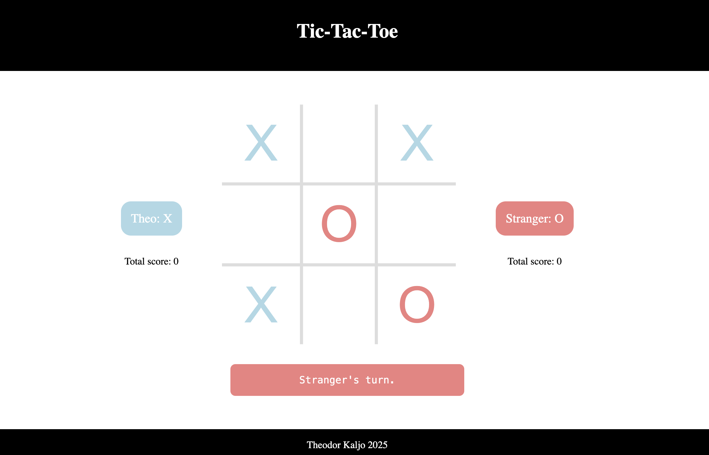

# Tic-Tac-Toe Game

This is a simple implementation of the classic Tic-Tac-Toe game using JavaScript. The game is designed for two players and features a dynamic board, player turns, victory detection, and tie handling.

See the live version here: https://theografiska.github.io/ticTacToe/

---

## Features

- **Game Board**: A 3x3 grid represented programmatically with cells that can store player tokens (`X` or `O`).
- **Players**: Two players can enter their names and take turns making moves.
- **Win Detection**: Automatically detects if a player has won by completing a row, column, or diagonal.
- **Tie Detection**: Declares a tie if all cells are filled and no player has won.
- **Reset Functionality**: Allows the game to be reset after a win or tie.
- **Dynamic Rendering**: Updates the game board and active player's turn dynamically in the DOM.

---

## Technologies Used

- **JavaScript**: Core game logic and DOM manipulation.
- **HTML**: Structure of the game interface.
- **CSS**: Styling for the game board and UI elements.

---

## Components

### `GameBoard`
- Represents the 3x3 grid for the game.
- Methods:
  - `getBoard()`: Returns the current state of the board.
  - `makeChoice(rowIndex, columnIndex, player)`: Places a player's token in the specified cell if it is empty.
  - `resetBoard()`: Resets the board to its initial empty state.
  - `printBoard()`: Logs the current state of the board to the console.

### `Cell`
- Represents a single square on the board.
- Methods:
  - `getChoice(player)`: Sets the value of the cell to the player's token.
  - `getValue()`: Retrieves the value of the cell.

### `Player`
- Represents a player in the game.
- Properties:
  - `name`: The player's name.
  - `token`: The player's token (`X` or `O`).

### `GameController`
- Manages the overall game flow.
- Features:
  - Tracks active player and switches turns.
  - Detects victory and tie conditions.
  - Resets the game when needed.

### `DisplayGame`
- Handles DOM updates for the game.
- Renders the board and manages player interactions through UI elements.

---

## Future Improvements

- Add animations for player moves and game outcomes.
- Implement an AI player for single-player mode.
- Enhance styling and responsiveness for different screen sizes.
- Add sound effects for interactions.

---

## License

This project is open-source and licensed under the MIT License. Feel free to use, modify, and distribute it as needed.